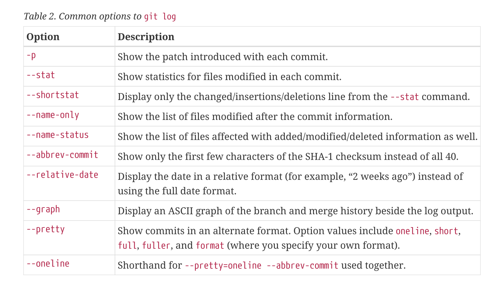
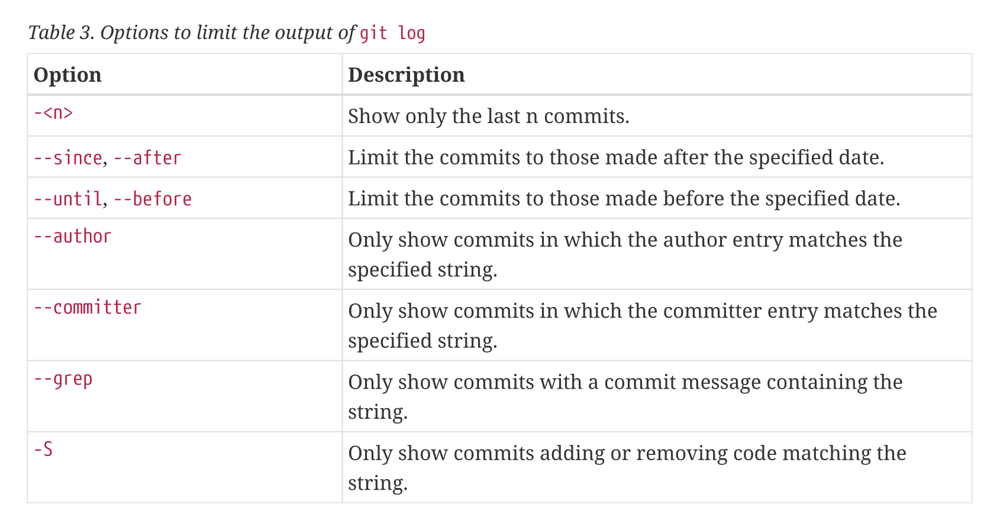
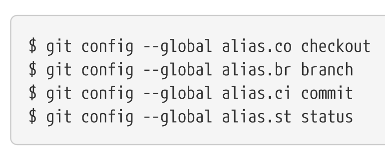

## Initialization

To initialize the git repository, we can either setup a new directory or clone it from an existing directory.

```sh
# Initialize a brand new git repository/directory
mkdir test
cd test
git init
```
OR, we can clone an existing repository from the remote server or other git directory in our local computer.

```sh
git clone https://github.com/libgit2/libgit2

# If you want to change the repository name from libgit2 to mylibgit
git clone https://github.com/libgit2/libgit2 mylibgit

# OR, to clone from local directory
git clone ~/dev/git-repo

```

To check whether the files are untracked, tracked if they are tracked in which state they are in? Are they unmodified, modified or staged? For this we need to see the status of the file first.

```sh
git status

# Add some files in the repository
echo "This is the first file" >> main.txt
echo "This is another file" >> first.txt

# Add these file to track
git add main.txt
git add first.txt

# Commit these staged files
git commit -m "Initial commit"
```

If you want to know not just which file is changed but what contents are changed, use `git diff`

```sh
git diff

# To see the changes in staged files
git diff --staged

# OR
git diff --cached

# To see changes made in a single file
git diff main.txt
```

To see the `git diff` in graphical mode, we can setup a `difftool`

If you give a command `git commit -v` instead of `git commit` it will give the changes to be commited as well.

If you want to skipp the staging area and commit directly, git provides a special command with `-a` flag.
```sh
git commit -a -m "Commit message"
```
This adds all the changes made in tracked file and add all of them automatically.

## Removing Files

To remove the file, use `rm filename` and `git rm filename` so that git will stage the changes. Also you can add `-f` flag for safety feature.

If you want to unstage the file but want to keep it in the project (for example file required but do not want to push, some gitignore files), use `git rm --cached filename`, it will remove the file from staging area and keep it untracked without deleting from the system/project. Then you can add it to `.gitignore` file.

You can also remove/unstage whole folder or file from subdirectories using `git rm log/\*.log` like command.

## Moving Files
To track file after renaming the file name, we can use `git mv file_from file_to` or `git mv old_file new_file`.

This command is equivalent to
```sh
mv old_file new_file
git rm old_file
git add new_file
```

## Viewing the Commit History
To see all the commit history associated with the repository, we use `git log` command.

We can use some flags to see details and limit the number of log, `git log -p -2`, this shows the `--patch` and limit `-2`.
```sh
git log -p -2

# OR
git log --patch -2
```

If you want to show the statistic of the files, which file and how many lines have changed (deleted or added).
```sh
git log --stat
```

Another command is `--pretty` with `oneline`, `short`, `full` and `fuller` flag.
```sh
git log --pretty=oneline
```

Most interesting option value is `format`.
```sh
git log --pretty=format:"%h - %an, %ar : %s"
```


To show the graph of committed history.
```sh
git log --pretty=format:"%h %s" --graph
```

Common options to `git log`.



## Limiting Log Output
We can add some time-limiting options, such as `--since`, `--until` or some date format `'2008-02-27'` or the relative date such as `"2 years 1 day 3 minutes ago"`.

```sh
git log --since=2.weeks

git log --since=2.days

git log --since=300.minutes

git log --since="2 years 1 day 3 minutes ago"

git log --author="Dhiraj Bhattarai"

git log --author="Dhiraj Bhattarai" --grep="Initial"
```

Options to limit the output of `git log`.


To see which commits modifying test files in the Git source code history were committed by Dhiraj Bhattarai in the month of June 2020 and are not merge commits.
```sh
git log --pretty="%h - %s" --author="Dhiraj Bhattarai" --since="2020-06-01" --before="2020-07-01" --no-merges
```

## Undoing Things
If you want to change the last commit, `git commit --amend` will help.

**Note:** Only commit if you have a full local copy and only a minor changes needed to be committed, because amend will remove the previous commit

## Unstaging a Staged File
To unstage the staged file to commit, use `git restore --staged file_name`.

If you want to undo the changes you have made to the files, you can use `git restore file_name` command.
```sh
# Restore the file from staging area
git restore --staged file_name

# Undo the changes made
git restore file_name
```

`git restore` is a dangerous command so, use it carefully.

## Working with Remotes
Remote repositories are versions of your project that are hosted on the Internet or network somewhere.

### Showing your remotes
You can show where the repository copied from using `git remote`.
```sh
git clone https://github.com/libgit2/libgit2

cd libgit2

git remote
```
Use `-v` flag to show the urls git has stored.
```sh
git remote -v
```
This may show multiple remote urls, where we can pull contributions from. (Multiple collaborator can work in same repository)

### Adding remote repositories
`git clone` command implicitly adds the `origin` remote but to add it explicitly as a shortname we can reference `git remote add <shortname> <url>`.
```sh
git remote add dyroz https://github.com/dhirajbhattarai/learning

git remote -v
```
Now you can use the shortname instead of whole url to fetch changes from the remote. `git fetch dyroz`

### Fetching information
Fetching command downloads the changes but does not merge the changes automatically, but `git pull` command automatically does the merging.

### Pushing to your remotes
To push your updates to the remote repository either you have to set the default value or explicitly git it to the command
```sh
git push origin master
```
This will push the information to the remote repository (shortname) `origin` and branch `master`.

### Inspecting a remote
To see particular information about the remote `git remote show <remote>`. For example `git remote show origin`.

### Renaming and Removing Remotes
You can run `git remote rename` to change the remote's shortname for example, `git remote rename dyroz dz` will change remote from `dyroz` to `dz`.

If you want to remove the remote, `git remote remove <remote>` or `git remote rm <remote>` do the job.

## Tagging
Git uses tagging to mark the specific points such as (`v0.1` or `v10.09.17` and so on).

### Listing Your Tags
To show the tags just type `git tag`, also can add flag `-l` or `--list`. To search the specific matching tags use:
```sh
git tag -l "v1.4.*"
```
This will list all the version tag which matches the `v1.4`.

### Creating Tags
Git supports two types of tags: lightweight and annotated

lightweight tag is like branch that doesn't change -- its just a pointer to a specific commit. `git tag <tag_name>`

annotated tag stores all the information about the tagger. `git tag -a <tag_name> -m <tag_message>`

### Annotated Tags
The easiest way to create an annotated tag is to specify `-a` when you run git tag command.
```sh
git tag -a v1.4 -m "This is the version v1.4"
```

You can see the git tag details using `git show <tag_name>` such as `git show v1.4`.

### Tagging Later
You can tag the previous commit as well using `git tag <tag_name> <checksum>`

### Sharing Tags
Git doesn't share tags, so we have to explicitly push it like we push the branches to the remote.
```sh
git push origin v1.5

# To push multiple tags at once
git push origin --tags

# To push only the annotated tags
git push origin --follow-tags
```

### Deleting Tags
To remove/delete tag from the local repository, use `git tag -d <tagname>` and if you want to remote it from the remote then use `git push origin --delete <tagname>`

### Checking Out Tags
To see the versions of the files a tag is pointing use `git checkout <tagname>`, which will detach the HEAD of commit.
This may have some ill side, you cannot track/reach if you commit after the checkout, so to handle this you need to create a new branch. `git checkout -b version2 v2.0`.

### Git Aliases
If you don’t want to type the entire text of each of the Git commands, you can easily set up an alias for each command using `git config`.



for example, instead of typing `git commit`, you just need to type `git ci`.